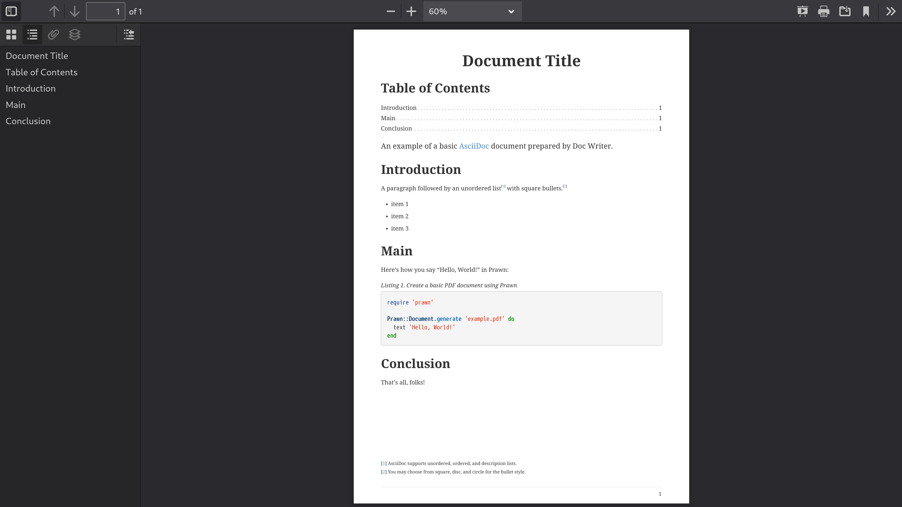

= Asciidoctor PDF: A native PDF converter for AsciiDoc
Dan Allen <https://github.com/mojavelinux[@mojavelinux]>; Sarah White <https://github.com/graphitefriction[@graphitefriction]>
v2.1.6, 2022-07-19
// Settings:
:experimental:
:idprefix:
:idseparator: -
ifndef::env-github[:icons: font]
ifdef::env-github,env-browser[]
:toc: macro
:toclevels: 1
endif::[]
ifdef::env-github[]
:status:
:!toc-title:
:caution-caption: :fire:
:important-caption: :exclamation:
:note-caption: :paperclip:
:tip-caption: :bulb:
:warning-caption: :warning:
endif::[]
// Aliases:
:project-name: Asciidoctor PDF
:project-handle: asciidoctor-pdf
// URLs:
:url-gem: https://rubygems.org/gems/asciidoctor-pdf
:url-project: https://github.com/asciidoctor/asciidoctor-pdf
:url-project-repo: {url-project}
:url-project-issues: {url-project-repo}/issues
:url-project-docs: https://docs.asciidoctor.org/pdf-converter/latest
:url-prawn: https://prawnpdf.org
:url-rvm: https://rvm.io

ifdef::status[]
image:https://img.shields.io/badge/zulip-join_chat-brightgreen.svg[project chat,link=https://asciidoctor.zulipchat.com/]
image:{url-project-repo}/workflows/CI/badge.svg[Build Status (GitHub Actions),link={url-project-repo}/actions?query=workflow%3ACI+branch%3Amain]
image:https://img.shields.io/gem/v/asciidoctor-pdf.svg[Latest Release, link={url-gem}]
endif::[]

Asciidoctor PDF is a native PDF converter for AsciiDoc that plugs into the `pdf` backend.
It bypasses the requirement to generate an intermediary format such as DocBook, Apache FO, or LaTeX.
Instead, you can use Asciidoctor PDF to convert your documents directly from AsciiDoc to PDF.
The aim of this library is to take the pain out of creating PDF documents from AsciiDoc.

[NOTE]
====
The documentation for the latest, stable release of Asciidoctor PDF is available at {url-project-docs}/.

If you're looking for the documentation for Asciidoctor PDF 1.6, refer to the {url-project-repo}/tree/v1.6.x#readme[README] in the v1.6.x branch.
Asciidoctor PDF 1.6 is no longer being developed and will reach EOL later this year.
You are encouraged to migrate to Asciidoctor PDF 2 as soon as possible.
====

toc::[]

== Overview

Asciidoctor PDF converts an AsciiDoc document directly to a PDF document.
The style and layout of the PDF are controlled by a dedicated theme file.
To the degree possible, Asciidoctor PDF supports all the features of AsciiDoc that are supported by Asciidoctor.
It also provides {url-project-docs}/features/[PDF-specific features].
However, there are {url-project-docs}/features/#limitations[certain limitations] imposed by the PDF format and the PDF library this extension uses.

Asciidoctor PDF uses the Prawn gem and Prawn's extensions, such as prawn-svg and prawn-table, to generate a PDF document.
{url-prawn}[Prawn] is a general purpose PDF generator for Ruby that features high-level APIs for common needs like setting up the page and inserting images and low-level APIs for positioning and rendering text and graphics.

TIP: For the latest Asciidoctor PDF features and fixes, see {url-project-docs}/whats-new/[What's New in Asciidoctor PDF].

== Prerequisites

Asciidoctor PDF is a Ruby application.
Therefore, to use it, you'll need a Ruby runtime.

The supported Ruby runtimes are Ruby 2.7 or greater and JRuby 9.2 or greater.
However, we always recommend using the most recent release of Ruby or JRuby.
All required libraries (i.e., gems) will be installed automatically when you install Asciidoctor PDF, which will be covered in the <<Install Asciidoctor PDF,next section>>.

To check if you have Ruby available, run the `ruby` command to print the installed version:

 $ ruby -v

Make sure this command reports a Ruby version that starts with 2.7 (or a JRuby version that starts with 9.2).
If so, you're ready to proceed.
If not, head over to {url-rvm}[rvm.io^] to get RVM and use it to install Ruby.

== Install Asciidoctor PDF

You can install Asciidoctor PDF using the `gem install` command.
We'll use this command to install the Asciidoctor PDF gem named *asciidoctor-pdf* that's published on RubyGems.org.
Pass the name of the gem to the `gem install` command as follows:

 $ gem install asciidoctor-pdf

Installing Asciidoctor PDF will install a number of other gems mentioned in these docs, including asciidoctor, prawn, prawn-svg, prawn-table, prawn-icon, and ttfunk.
For the most part, the versions of these dependencies are locked to the version of Asciidoctor PDF.

For further installation information about installing Asciidoctor PDF, see {url-project-docs}/install/[the installation documentation].
For troubleshooting help, see {url-project-docs}/install/#installation-troubleshooting[Installation troubleshooting].

=== Install a prerelease or development version

To install the latest prerelease of the *asciidoctor-pdf* gem from RubyGems.org (if a prerelease is available), use the following command:

 $ gem install asciidoctor-pdf --pre

You can also {url-project-repo}/blob/main/CONTRIBUTING-CODE.adoc[run the code from source] if you want to use a development version or participate in development.

== Optional dependencies

There are several optional features of this converter that require additional gems to be installed.
Those features are as follows.

Source highlighting::
You'll need to {url-project-docs}/syntax-highlighting/[install a syntax highlighter] to use source highlighting (build-time only).

PDF optimization::
If you want to optimize your PDF, you'll need rghost or hexapdf.
See {url-project-docs}/optimize-pdf/[Optimize the PDF] for installation and usage instructions.

Automatic hyphenation::
To turn on automatic hyphenation using the `hyphens` attribute, you'll need to install the `text-hyphen` gem:

 $ gem install text-hyphen

Accelerated image decoding::
Ruby is not particularly fast at decoding images, and the image formats it supports are limited.
To help, you can install prawn-gmagick, which delegates the work of decoding images to GraphicsMagick.
Refer to {url-project-docs}/image-paths-and-formats/#other-image-formats[Supporting additional image file formats] for instructions about how to enable this integration.

Check the {url-project-docs}/install/#table-minimum-version[minimum supported version table] to make sure you're using a supported version of the dependency.

== Run the Application

Assuming all the required gems install properly, verify you can run the `asciidoctor-pdf` script:

 $ asciidoctor-pdf -v

If you see the version of {project-name} printed, you're ready to use {project-name}!

Let's grab an AsciiDoc document to distill and start putting {project-name} to use.

If you don't already have an AsciiDoc document to work with, you can use the <<examples/basic-example.adoc#,basic-example.adoc>> file found in the _examples_ directory of this project.
Copy it to the current directory as follows:

 $ cp examples/basic-example.adoc .

Let's take a look at the contents of that file.

ifeval::[{safe-mode-level} >= 20]
See <<examples/basic-example.adoc#,basic-example.adoc>>.
endif::[]
ifeval::[{safe-mode-level} < 20]
.basic-example.adoc
[source,asciidoc]
....
include::examples/basic-example.adoc[]
....
endif::[]

It's time to convert the AsciiDoc document directly to PDF.

=== Convert AsciiDoc to PDF

IMPORTANT: You'll need the `rouge` gem installed to run this example since it uses the `source-highlighter` attribute with the value of `rouge`.

Converting to PDF is as straightforward as running the `asciidoctor-pdf` script using Ruby and passing the AsciiDoc document as the first argument:

 $ asciidoctor-pdf basic-example.adoc

This command is a shorter way of running `asciidoctor` with the PDF converter and backend enabled:

 $ asciidoctor -r asciidoctor-pdf -b pdf basic-example.adoc

The `asciidoctor-pdf` command saves you from having to remember these low-level options.
That's why we provide it.

When the script completes, you should see the file [.path]_basic-example.pdf_ in the current directory.
Asciidoctor creates the output file in the same directory as the input file by default.
Open the [.path]_basic-example.pdf_ file with a PDF viewer to see the result.

.Example PDF document rendered in a PDF viewer

For more information about how to use Asciidoctor PDF and PDF-specific AsciiDoc syntax, see the {url-project-docs}/[Asciidoctor PDF documentation].

== Themes

The layout and styling of the PDF is driven by a YAML configuration file.
To learn how the theming system works and how to create and apply custom themes, refer to the {url-project-docs}/theme/[Asciidoctor PDF theming documentation].

ifndef::env-site[]
== Contributing

See the <<CONTRIBUTING.adoc#,contributing guide>>.
To help develop {project-name}, or to simply use the development version, refer to the <<CONTRIBUTING-CODE.adoc#,developing and contributing code guide>>.

== Authors

{project-name} was written by https://github.com/mojavelinux[Dan Allen] and https://github.com/graphitefriction[Sarah White] of OpenDevise Inc. on behalf of the Asciidoctor Project.

== Copyright

Copyright (C) 2014-present OpenDevise Inc. and the Asciidoctor Project.
Free use of this software is granted under the terms of the MIT License.

For the full text of the license, see the link:LICENSE[] file.
Refer to the <<NOTICE.adoc#,NOTICE>> file for information about third-party Open Source software in use.
