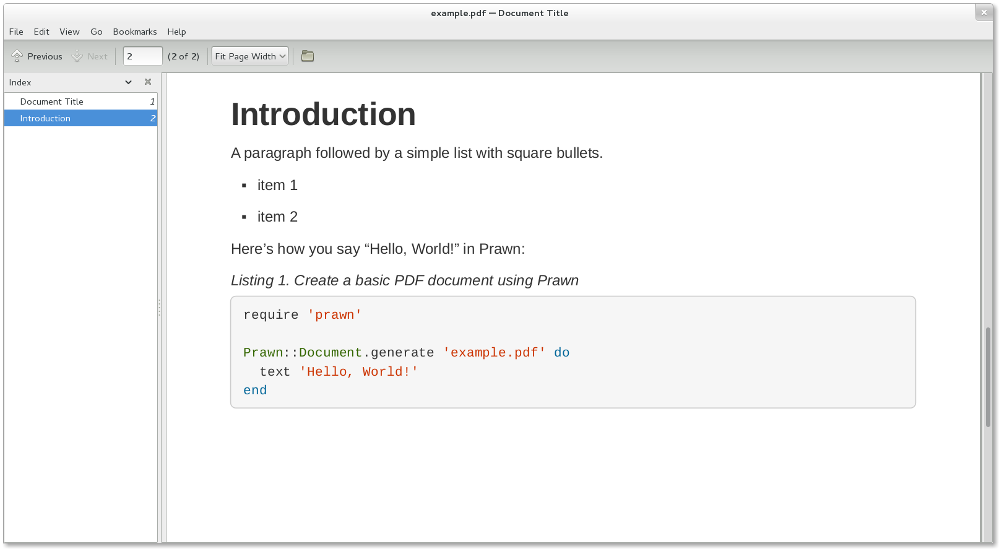

= Asciidoctor PDF: A native PDF converter for AsciiDoc
Dan Allen <https://github.com/mojavelinux[@mojavelinux]>; Sarah White <https://github.com/graphitefriction[@graphitefriction]>
// Settings:
:experimental:
:idprefix:
:idseparator: -
ifndef::env-github[:icons: font]
ifdef::env-github,env-browser[]
:toc: macro
:toclevels: 1
endif::[]
ifdef::env-github[]
:status:
:!toc-title:
:caution-caption: :fire:
:important-caption: :exclamation:
:note-caption: :paperclip:
:tip-caption: :bulb:
:warning-caption: :warning:
endif::[]
// Aliases:
:project-name: Asciidoctor PDF
:project-handle: asciidoctor-pdf
// Variables:
:release-version: 1.5.0
// URIs:
:url-asciidoctor: http://asciidoctor.org
:url-gem: http://rubygems.org/gems/asciidoctor-pdf
:url-project: https://github.com/asciidoctor/asciidoctor-pdf
:url-project-repo: {url-project}
:url-project-issues: {url-project-repo}/issues
:url-project-list: http://discuss.asciidoctor.org
:url-prawn: http://prawnpdf.org
:url-prawn-gmagick: https://github.com/packetmonkey/prawn-gmagick
:url-prawn-svg: https://github.com/mogest/prawn-svg
:url-asciidoctor-mathematical: https://github.com/asciidoctor/asciidoctor-mathematical
:url-rvm: http://rvm.io
:url-graphicsmagick: http://www.graphicsmagick.org

ifdef::status[]
image:https://img.shields.io/travis/asciidoctor/asciidoctor-pdf/master.svg[Build Status (Travis CI),link=https://travis-ci.org/asciidoctor/asciidoctor-pdf]
image:https://github.com/asciidoctor/asciidoctor-pdf/workflows/CI/badge.svg[Build Status (GitHub Actions),link=https://github.com/asciidoctor/asciidoctor-pdf/actions?query=workflow%3ACI]
image:https://img.shields.io/gem/v/asciidoctor-pdf.svg[Latest Release, link={url-gem}]
image:https://img.shields.io/badge/license-MIT-blue.svg[MIT License, link=#copyright]
endif::[]

Asciidoctor PDF is a native PDF converter for AsciiDoc.
It bypasses the requirement to generate an intermediary format such as DocBook, Apache FO, or LaTeX.
Instead, you can use this extension to convert your documents directly from AsciiDoc to PDF.
Its aim is to take the pain out of creating PDF documents from AsciiDoc.

toc::[]

== Overview

{project-name} is an Asciidoctor extension that converts an AsciiDoc document directly to a PDF document.
The style and layout of the PDF is controlled by a dedicated theme file.
To the degree possible, this converter supports all the features of AsciiDoc that are supported by the built-in converters.
However, there are <<known-limitations,certain limits>> imposed by the PDF format and the PDF library this extension uses.

Under the covers, {project-name} uses the Prawn gem and its extensions (e.g., prawn-svg and prawn-table) to generate the PDF document.
{url-prawn}[Prawn] is a general purpose PDF generator for Ruby that features high-level APIs for common needs like setting up the page and inserting images and low-level APIs for positioning and rendering text and graphics.

Prawn takes the pain out of creating (basic) PDF documents.
Likewise, {project-name} takes the pain out of creating PDF documents _directly from AsciiDoc_.
Skip ahead to <<getting-started,Getting started>> to start putting {project-name} use.
But don't miss the <<Highlights>> to get a preview of what's possible.

== Highlights

* Direct AsciiDoc to PDF conversion
* <<docs/theming-guide.adoc#,Configuration-driven theme (style and layout)>>
* Custom fonts (TTF or OTF)
* Full SVG support (thanks to https://github.com/mogest/prawn-svg[prawn-svg])
* PDF document outline (i.e., bookmarks)
* Title page
* Table of contents page(s)
* Document metadata (title, authors, subject, keywords, etc.)
* Configurable page size (e.g., A4, Letter, Legal, etc)
* Internal cross reference links
* Syntax highlighting with Rouge (preferred), Pygments, or CodeRay
* Cover pages
* Page background color or page background image with named scaling
* Page numbering
* Double-sided (aka prepress) printing mode (i.e., margins alternate on recto and verso pages)
* Customizable running content (header and footer)
* “Keep together” blocks (i.e., page breaks avoided in certain block content):
** Explicitly delimited blocks other than open blocks
** Open blocks with the "unbreakable" option `[%unbreakable]`
* Orphaned section titles avoided
* Autofit verbatim blocks (as permitted by base_font_size_min setting)
* Table border settings honored
* Font-based icons
* Auto-generated index
* Automatic hyphenation (when enabled)
* Permissive line breaking for CJK languages
* Compression / optimization of output file

== Known Limitations

* Footnotes are always displayed as endnotes (at the end of chapter for books; at the end of document for all other doctypes).
*Footnotes cannot be displayed at the bottom of the page because the PDF generator does not support content reflows* (see https://github.com/asciidoctor/asciidoctor-pdf/issues/85#issuecomment-577412975[#85] for reasoning).
* Table cells that exceed the height of a single page will be truncated (see https://github.com/prawnpdf/prawn-table/issues/41[prawn-table#41]).
* Inline images in table cells must fit within available column width or a Prawn::Errors::CannotFit error will be thrown (see https://github.com/asciidoctor/asciidoctor-pdf/issues/1608 for workarounds).
* Columns cannot be assigned a 0% width (or a width less than the width of a single character); in the same vein, a column cannot be set to autowidth if width of all other columns meets or exceeds 100%; the result is that the converter with throw a Prawn::Errors::CannotFit error.
* An inline image in a table cell will not force the column wider if the width of the image exceeds the width of the column; either reduce the image width using `pdfwidth` or increase the width of the column using `cols`; another solution is to convert the cell to an AsciiDoc table cell (see https://github.com/asciidoctor/asciidoctor-pdf/issues/830).
* Must use development version of prawn-table for autowidth to work on table head row.
* Must use development version of prawn for error to include font name when requested font style is missing.
* AsciiDoc table cell leaves padding below last block (due to lack of margin collapsing).
* Prawn does not support double-wide box drawing glyphs correctly, so box drawings aren't aligned properly in verbatim blocks (see https://github.com/prawnpdf/prawn/issues/1002[prawn#1002].
* Orphan / widow support is limited; a page break can occur between a section title and its section content, a table caption and the caption, etc.; use a manual page break to avoid.
* If a no-break hyphen is surrounded by formatted text on both sides (or is formatted individually), it will not prevent a line break.
* Images cannot float.
* Verse blocks do not use a fixed-width font by default, but you can control this setting using the theme.
//* Must use Ruby >= 2.4 for natural cross references to work with non-ASCII titles.

== Prerequisites

All that's needed is Ruby 2.5 or better (or JRuby 9.2 or better) and a few Ruby gems (including at least Asciidoctor 2.0.0), which we explain how to install in the next section.

To check if you have Ruby available, use the `ruby` command to query the version installed:

 $ ruby -e 'puts RUBY_VERSION'

Make sure this command reports a Ruby version that's at least 2.5.
If so, you may proceed.

=== System Encoding

Asciidoctor assumes you're using UTF-8 encoding.
To minimize encoding problems, make sure the default encoding of your system is set to UTF-8.

If you're using a non-English Windows environment, the default encoding of your system may not be UTF-8.
As a result, you may get an `Encoding::UndefinedConversionError` or other encoding issues when invoking Asciidoctor.
To solve these problems, we recommend at least changing the active code page in your console to UTF-8.

 chcp 65001

Once you make this change, all your Unicode headaches will be behind you.

== Getting Started

You can get {project-name} by <<install-the-published-gem,installing the published gem>>.
ifndef::env-site[You can also <<development,run the code from source>> if you want to use a development version or participate in development.]

=== Install the Published Gem

To install {project-name}, first make sure you have satisfied the <<Prerequisites,prerequisites>>.
Then, install the gem from RubyGems.org using the following command:

 $ gem install asciidoctor-pdf

==== Installation Troubleshooting

If you get a permission error while installing the gem, such as the one below, it's likely you're attempting to install the gem directly into your system.
Installing gems for tech writing directly into your system is not recommended.

.Permission error when attempting to install as a system gem
....
ERROR:  While executing gem ... (Gem::FilePermissionError)
    You don't have write permissions for the /Library/Ruby/Gems/2.x.x directory.
....

A better practice (and one that will ensure your sanity) is to ignore any version of Ruby installed on your system and use {url-rvm}[RVM] to manage the Ruby installation instead.
The benefit of this approach is that a) Ruby is guaranteed to be set up correctly, b) installing gems will in no way interfere with the operation of your system, and c) any bin scripts provided by the installed gems will be available on your PATH.
All files are managed in user space (aka your home or user directory).
If something gets messed up, you can simply remove the [.path]_$HOME/.rvm_ folder and start over.

To learn how to install RVM, follow the https://asciidoctor.org/docs/install-asciidoctor-macos/#rvm-procedure-recommended[RVM installation procedure] covered in the Asciidoctor documentation.
Once you have installed RVM and used it to install Ruby, make sure to activate the Ruby managed by RVM using `rvm use default` or a specific Ruby version like `rvm use 2.7`.
(You'll need to do this each time you open a new terminal).

After installing the gem, you can see where it was installed using the following command:

 $ gem which asciidoctor-pdf

To see where the bin script is located, use this command:

 $ command -v asciidoctor-pdf

Both paths should be underneath the [.path]_$HOME/.rvm_ directory.
If not, check your RVM setup.

==== Install a Syntax Highlighter (optional)

If you want to syntax highlight source listings, you'll also want to install Rouge, Pygments, or CodeRay.
Choose one (or more) of the following:

.Rouge (preferred, minimum version: 2.0.0)
 $ gem install rouge

.Pygments
 $ gem install pygments.rb

.CodeRay
 $ gem install coderay

You then activate syntax highlighting for a given document by adding the `source-highlighter` attribute to the document header (Rouge shown):

[source,asciidoc]
----
:source-highlighter: rouge
----

==== Upgrade Prawn and Extensions (optional)

{project-name} uses Prawn to handle the PDF generation, which has a different release cycle.
At times, there may be development features in Prawn and its extensions you need to use which haven't yet been released.
No problem.
You can still gain access to these features by installing the unreleased gems directly from GitHub.

To get started, first create a [.path]_Gemfile_ in the root of your project.
In that file, declare the gem source, the {project-handle} gem, and the prawn gem and/or one of its extension gems.
In this example, we'll install both the prawn and prawn-table gems from GitHub.

.Gemfile
[source,ruby]
----
source 'https://rubygems.org'

gem 'asciidoctor-pdf'
gem 'prawn', github: 'prawnpdf/prawn'
gem 'prawn-table', github: 'prawnpdf/prawn-table'
----

You can then install the gems into your project using the `bundle` command:

 $ bundle config set --local path .bundle/gems && bundle

Since you're using Bundler to manage the gems, you'll need to prefix all commands with `bundle exec`.
For example:

 $ bundle exec asciidoctor-pdf -v

Thus, to any command present in the following sections, be sure to include this prefix.

=== Run the Application

Assuming all the required gems install properly, verify you can run the `asciidoctor-pdf` script:

 $ asciidoctor-pdf -v

If you see the version of {project-name} printed, you're ready to use {project-name}!

Let's grab an AsciiDoc document to distill and start putting {project-name} to use.

=== An Example AsciiDoc Document

If you don't already have an AsciiDoc document, you can use the <<examples/basic-example.adoc#,basic-example.adoc>> file found in the examples directory of this project.

ifeval::[{safe-mode-level} >= 20]
See <<examples/basic-example.adoc#,basic-example.adoc>>.
endif::[]
ifeval::[{safe-mode-level} < 20]
.basic-example.adoc
[source,asciidoc]
....
include::examples/basic-example.adoc[]
....
endif::[]

It's time to convert the AsciiDoc document directly to PDF.

=== Convert AsciiDoc to PDF

IMPORTANT: You'll need the `rouge` gem installed to run this example since it uses the `source-highlighter` attribute with the value of `rouge`.

Converting to PDF is as simple as running the `asciidoctor-pdf` script using Ruby and passing our AsciiDoc document as the first argument.

 $ asciidoctor-pdf basic-example.adoc

This command is just a shorthand way of running:

 $ asciidoctor -r asciidoctor-pdf -b pdf basic-example.adoc

The `asciidoctor-pdf` command just saves you from having to remember all those flags.
That's why we created it.

When the script completes, you should see the file [.path]_basic-example.pdf_ in the same directory.
Open the [.path]_basic-example.pdf_ file with a PDF viewer to see the result.

.Example PDF document rendered in a PDF viewer

ifndef::env-site[]
You're also encouraged to try converting this <<README.adoc#,README>> as well as the documents in the examples directory to see more of what {project-name} can do.
endif::[]

The pain of the DocBook toolchain should be melting away about now.

== Themes

The layout and styling of the PDF is driven by a YAML configuration file.
To learn how the theming system works and how to create and apply custom themes, refer to the <<docs/theming-guide.adoc#,Asciidoctor PDF Theming Guide>>.
You can use the built-in theme files, which you can find in the [.path]_data/themes_ directory, as examples.

If you've enabled a source highlighter, you can control the style (aka theme) it applies to source blocks using the `coderay-style`, `pygments-style`, and `rouge-style` attributes, respectively.
For example, to configure Rouge to use the built-in monokai theme, run Asciidoctor PDF as follows:

 $ asciidoctor-pdf -a rouge-style=monokai basic-example.adoc

It's possible to develop your own theme for Rouge.
Refer to the <<docs/theming-guide.adoc#,Asciidoctor PDF Theming Guide>> for details.

== Support for Non-Latin Languages

Asciidoctor can process the full range of characters in the UTF-8 character set.
That means you can write your document in any language, save the file with UTF-8 encoding (_that's important!_), and expect Asciidoctor to convert the text properly.
But you still need a font that provides the glyphs for those characters.

When converting a document with Asciidoctor PDF, you may notice that some glyphs for certain languages, such as Chinese, are missing from the PDF.
PDF is a "`bring your own font`" kind of system.
In other words, the font you provide must provide glyphs for all the characters used.
There's no one font that supports all the world's languages (though some, like Noto Serif, certainly come close).
Even if there were such a font, bundling that font with the main gem would make it enormous.
It would also severely limit the style choices in the default theme, which targets Latin-based languages.
Therefore, we're taking the strategy of creating separate dedicated theme gems that target each language family, such as CJK.
Read on to find out how to use these themes.

Asciidoctor PDF provides a built-in theme that provides a broad range of characters in the CJK charsets, so you can start with that theme:

 $ asciidoctor-pdf -a scripts=cjk -a pdf-theme=default-with-fallback-font document.adoc

Notice the `-a scripts=cjk` option.
That's important.
It tells the converter to insert break opportunities between CJK characters so that the line wraps properly when mixing English and a CJK language like Japanese.

If the built-in theme with the fallback font doesn't go far enough, you'll need to use a theme that is optimized for CJK text.
You can get such a theme by installing the `asciidoctor-pdf-cjk-kai_gen_gothic` gem.
The https://github.com/chloerei/asciidoctor-pdf-cjk-kai_gen_gothic[asciidoctor-pdf-cjk-kai_gen_gothic] project provides themes optimized for CJK languages based on the kai_gen_gothic font.
See the https://github.com/chloerei/asciidoctor-pdf-cjk-kai_gen_gothic[asciidoctor-pdf-cjk-kai_gen_gothic] project README for detailed setup instructions.

WARNING: The theme provided by the `asciidoctor-pdf-cjk-kai_gen_gothic` gem is no longer compatiable with the stable release of Asciidoctor PDF.
However, you can still use it to create a <<Create a Custom CJK Theme,custom CJK theme>>.

Once you have that gem installed (and the fonts), you need to tell Asciidoctor PDF to use one of the themes.
If you're converting a document that is primarily written in Japanese, you'd run Asciidoctor PDF as follows:

 asciidoctor-pdf -r asciidoctor-pdf-cjk-kai_gen_gothic -a pdf-theme=KaiGenGothicJP document.adoc

If that command fails, you may have better luck creating your own CJK theme.

=== Create a Custom CJK Theme

You also have to option of creating your own theme gem that uses fonts of your choice.
For example, if you want to use the `asciidoctor-pdf-cjk-kai_gen_gothic` gem to fetch fonts, but then use them in your own theme, here's how you'd do it.

. Install the `asciidoctor-pdf-cjk-kai_gen_gothic` gem:

 $ gem install asciidoctor-pdf-cjk-kai_gen_gothic

. Download / install the fonts:

 $ asciidoctor-pdf-cjk-kai_gen_gothic-install

. Create a theme file named [.path]_cjk-theme.yml_ that extends the default theme to override the fonts:
+
[source,yml]
----
extends: default
font:
  catalog:
    merge: true
    KaiGen Gothic CN:
      normal: KaiGenGothicCN-Regular.ttf
      bold: KaiGenGothicCN-Bold.ttf
      italic: KaiGenGothicCN-Regular-Italic.ttf
      bold_italic: KaiGenGothicCN-Bold-Italic.ttf
  fallbacks:
  - KaiGen Gothic CN
base:
  font-family: KaiGen Gothic CN
heading:
  font-family: $base-font-family
abstract:
  title:
    font-family: $heading-font-family
sidebar:
  title:
    font-family: $heading-font-family
----

. Load your theme when running Asciidoctor PDF:

 $ asciidoctor-pdf -a scripts=cjk -a pdf-theme=./cjk-theme.yml -a pdf-fontsdir=GEM_FONTS_DIR,`ruby -r asciidoctor-pdf-cjk-kai_gen_gothic -e "print File.expand_path '../fonts', (Gem.datadir 'asciidoctor-pdf-cjk-kai_gen_gothic')"` document.adoc

The `-a pdf-fontsdir` option is important to tell Asciidoctor PDF where to find your custom fonts.
(Note that the inclusion of GEM_FONTS_DIR in the value is only required when using Asciidoctor PDF 1.5).

Rather than using the installer from the `asciidoctor-pdf-cjk-kai_gen_gothic` gem, you can download fonts whatever way you choose.
When using your own fonts, be sure to consult the <<docs/theming-guide.adoc#preparing-a-custom-font,Preparing a Custom Font>> section of the theming guide to find recommended modifications.

== Font-Based Icons

You can use icons in your PDF document using any of the following icon sets:

* *fa* - https://fontawesome.com/v4.7.0/icons (default)
* *fas* - https://fontawesome.com/icons?d=gallery&s=solid[Font Awesome - Solid^]
* *fab* - https://fontawesome.com/icons?d=gallery&s=brands[Font Awesome - Brands^]
* *far* - https://fontawesome.com/icons?d=gallery&s=regular[Font Awesome - Regular^]
* *fi* - http://zurb.com/playground/foundation-icon-fonts-3[Foundation Icons^]
* *pf* - https://paymentfont.com/[Payment font^]

The fa icon set is deprecated.
Please use one of the other three FontAwesome icon sets.

You can enable font-based icons by setting the following attribute in the header of your document:

[source,asciidoc]
----
:icons: font
----

If you want to override the font set globally, also set the `icon-set` attribute:

[source,asciidoc]
----
:icons: font
:icon-set: pf
----

Here's an example that shows how to use the Amazon icon from the payment font (pf) icon set in a sentence (assuming the `icon-set` is set to `pf):

[source,asciidoc]
----
Available now at icon:amazon[].
----

You can use the `set` attribute on the icon macro to override the icon set for a given icon.

[source,asciidoc]
----
Available now at icon:amazon[set=pf].
----

You can also specify the font set using the following shorthand.

[source,asciidoc]
----
Available now at icon:amazon@pf[].
----

In addition to the sizes supported in the HTML backend (lg, 1x, 2x, etc), you can enter any relative value in the size attribute (e.g., 1.5em, 150%, etc).

[source,asciidoc]
----
icon:android[size=40em]
----

You can enable use of fonts during PDF generation (instead of in the document header) by passing the `icons` attribute to the `asciidoctor-pdf` command.

 $ asciidoctor-pdf -a icons=font -a icon-set=pf sample.adoc

Icon-based fonts are handled by the `prawn-icon` gem.
To find a complete list of available icons, consult the https://github.com/jessedoyle/prawn-icon/tree/master/data/fonts[prawn-icon] repository.

== Image Paths

Images are resolved at the time the converter runs.
That means they need to be located where the converter can find them.

Relative images paths in the document are resolved relative to the value of the `imagesdir` attribute.
This is effectively the same as how the built-in HTML converter works when the `data-uri` attribute is set.
The `imagesdir` is blank by default, which means relative images paths are resolved relative to the input document.
Relative images paths in the theme are resolved relative to the value of the `pdf-themesdir` attribute (which defaults to the directory of the theme file).
The `imagesdir` attribute is not used when resolving an image path in the theme file.
Absolute image paths are used as is.

If the image is an SVG, and the SVG includes a nested raster image (PNG or JPG) with a relative path, that path is resolved relative to the directory that contains the SVG.

The converter will refuse to embed an image if the target is a URI (including image references in an SVG) unless the `allow-uri-read` attribute is enabled via the CLI or API.

If you use a linked image in an SVG, the width and height of that image must be specified.
Otherwise, the SVG library will fail to process it.

=== Asciidoctor Diagram Integration

As of Asciidoctor PDF 1.5.0.alpha.17 running on Asciidoctor 2 or better, Asciidoctor PDF provides better integration with Asciidoctor Diagram by setting the `data-uri` attribute by default.
When the `data-uri` attribute is set, Asciidoctor Diagram returns the absolute path to the generated image, which Asciidoctor PDF can then locate.
(This makes sense since technically, Asciidoctor Diagram must embed the image in the document, similar in spirit to the `data-uri` feature for HTML).
This means the input directory and the output directory (and thus the imagesoutdir) can differ and Asciidoctor PDF will still be able to locate the generated image.

Prior to Asciidoctor PDF 1.5.0.alpha.17 (or prior to Asciidoctor 2), the way to solve this problem is to set the `imagesdir` attribute to an absolute path.
That way, it won't matter where the generated image is written.
Asciidoctor PDF will still be able to find it.
Keep in mind that this strategy may introduce other side effects you'll have to work around.

== Image Scaling

Since PDF is a fixed-width canvas, you almost always need to specify a width to get the image to fit properly on the page.
There are five ways to specify the width of an image, listed here in order of precedence:

[cols="1s,3"]
|===
|Attribute{nbsp}Name | Description

|pdfwidth
|The display width of the image as an absolute size (e.g., 2in), percentage of the content area width (e.g., 75%), or percentage of the page width (e.g., 100vw).
If a unit of measurement is not specified (or not recognized), pt (points) is assumed.
_Intended to be used for the PDF converter only._

|scaledwidth
|The display width of the image as an absolute size (e.g., 2in) or percentage of the content area width (e.g., 75%).
If a unit of measurement is not specified, % (percentage) is assumed.
If a unit of measurement is recognized, pt (points) is assumed.
_Intended to be used for print output such as PDF._

|image_width key from theme
|Accepts the same values as pdfwidth.
_Only applies to block images._

|width
|The unitless display width of the image (assumed to be pixels), typically matching the intrinsic width of the image.
If the value ends in % (not recommended), it's assumed to be the percentage of the available content area width.
If the width exceeds the content area width, the image is scaled down to the content area width.

|_unspecified_
|If you don't specify one of the aforementioned width settings, the intrinsic width of the image is used (the px value is multiplied by 75% to convert to pt, assuming canvas is 96 dpi) unless the width exceeds the content area width, in which case the image is scaled down to the content area width.
|===

The image is always sized according to the explicit or intrinsic width, then its height is scaled proportionally.
The height of the image is ignored by the PDF converter unless the height of the image exceeds the content height of the page.
In this case, the image is scaled down to fit on a single page.

If you want a block image to align to the boundaries of the page (not the content margin), specify the `align-to-page` option (e.g., `opts="align-to-page"`).
This is most useful when using vw units because you can make the image cover the entire width of the page.

Images in running content and page background images also support the `fit` attribute (when specified using the image macro).
See <<Background Image Sizing>> for details.

=== Using the pdfwidth Attribute

The pdfwidth attribute is the recommended way to set the image size for the PDF output.
This attribute is provided for two reasons.
First, the fixed-width canvas often calls for a width that is distinct from other output formats, such as HTML.
Second, this attribute allows the width to be expressed using a variety of units.

The pdfwidth attribute supports the following units:

* pt (default)
* in
* cm
* mm
* px
* pc
* vw (percentage of page width)
* % (percentage of content area width)

In all cases, the width is converted to pt.

=== Specifying a Default Width

If you want to scale all block images that don't have a pdfwidth or scaledwidth attribute specified, assign a value to the image_width key in your theme.

[source,yaml]
----
image:
  width: 100%
----

=== Inline Image Sizing

Inline images can be sized in much the same way as block images (using the pdfwidth, scaledwidth or width attributes), with the following exceptions:

* The viewport width unit (i.e., vw) is not recognized in this context.
* The image will be scaled down, if necessary, to fit the width and height of the content area.
* Inline images do not currently support a default width controlled from the theme.

To confine the inline image to the height of the line while preserving the aspect ratio, use the attribute `fit=line`.

If the resolved height of the image is less than or equal to 1.5 times the line height, the image won't disrupt the line height and is centered vertically in the line.
This is done to maximize the use of available space.
Once the resolved height exceeds this amount, the height of the line is increased (by increasing the font size of the invisible placeholder text) to accommodate the image.
In this case, the surrounding text will be aligned to the bottom of the image.
If the image height exceeds the height of the page, the image will be scaled down to fit on a single page (this may cause the image to advance to the subsequent page).

=== Background Image Sizing

In addition to the width-related attributes previously covered, cover and background images can be sized relative to the page using the `fit` attribute of the image macro.
The `fit` attribute works similarly to the `object-fit` property in CSS.
Its value must be specified as a single keyword, chosen from the table below.
The starting size of the image is determined by the explicit width, if specified, or the implicit width.
The height is always derived from the width while respecting the implicit aspect ratio of the image.
The available space for a background image (i.e., the canvas) is the page.
If the `fit` attribute is not specified, it defaults to `contain` (i.e., the image is automatically scaled to fit the bounds of the page).

[cols="1s,3"]
|===
| Value | Purpose

| contain
| The image is scaled up or down while retaining its aspect ratio to fit within the available space. (default)

| cover
| The image is scaled up or down while retaining its aspect ratio so the image completely covers the available space, even if it means the image must be clipped in one direction.

| scale-down
| The image is scaled down while retaining its aspect ratio to fit within the available space.
If the image already fits, it is not scaled.

| fill
| The image is scaled to fit the available space even if it means modifying the aspect ratio of the image.
Does not apply to SVG images.

| none
| The image is not scaled.
|===

The `fit` attribute is often combined with the `position` attribute, covered next, to control the placement of the image on the canvas.

== Background Image Positioning

In addition to scaling, background images for cover pages, content pages, and the title page support positioning via the `position` attribute.
The `position` attribute accepts a syntax similar to the `background-position` property in CSS, except only the keyword positions are supported.
The position consists of two values, the vertical position and the horizontal position (e.g., `top center`).
If only one value is specified (e.g., `top`), the other value is assumed to be `center`.
If the `position` attribute is not specified, the value is assumed to be `center center` (i.e., the image is centered on the page).

The following table provides a list of the vertical and horizontal positioning keywords that are supported.
You can use any combination of these keywords to position the image.

|===
| Vertical Positions | Horizontal Positions

| top +
center +
bottom

| left +
center +
right
|===

Here's an example of how to place a background image at the top center of every page:

----
:page-background-image: image:bg.png[fit=none,pdfwidth=50%,position=top]
----

Here's how to move it to the bottom right:

----
:page-background-image: image:bg.png[fit=none,pdfwidth=50%,position=bottom right]
----

If an image dimension matches the height or width of the page, the positioning keyword for that axis has no effect.

== Fonts in SVG Images

Asciidoctor PDF uses {url-prawn-svg}[prawn-svg] to embed SVGs in the PDF document, including SVGs generated by Asciidoctor Diagram.

Actually, it's not accurate to say that prawn-svg embeds the SVG.
Rather, prawn-svg is an SVG _renderer_.
prawn-svg translates an SVG into native PDF text and graphic objects.
You can think of the SVG as a sequence of drawing commands.
The result becomes indistinguishable from other PDF objects.

What that means for text is that any font family used for text in the SVG _must_ be registered in the Asciidoctor PDF theme file (and thus with Prawn).
Otherwise, Prawn will fallback to using the closest matching built-in (afm) font from PDF (e.g., sans-serif becomes Helvetica).
Recall that afm fonts only support basic Latin.
As we like to say, PDF is <<docs/theming-guide.adoc#built-in-afm-fonts,bring your own font>>.

If you're using Asciidoctor Diagram to generate SVGs to embed in the PDF, you likely need to specify the default font the diagramming tool uses.
Let's assume you are making a plantuml diagram.

To set the font used in the diagram, first create a file named [.path]_plantuml.cfg_ and populate it with the following content:

----
skinparam defaultFontName Noto Serif
----

TIP: You can choose any font name that is registered in your Asciidoctor PDF theme file.
When using the default theme, your options are "Noto Serif", "M+ 1mn", and "M+ 1p Fallback".

Next, pass that path to the `plantumlconfig` attribute in your AsciiDoc document (or set the attribute via the CLI or API):

----
:plantumlconfig: plantuml.cfg
----

Clear the cache of your diagrams and run Asciidoctor PDF with Asciidoctor Diagram enabled.
The diagrams will be generated using Noto Serif as the default font, and Asciidoctor PDF will know what to do.

The bottom line is this:
If you're using fonts in your SVG, and you want those fonts to be preserved, those fonts must be defined in the Asciidoctor PDF theme file.

== Supporting Additional Image File Formats

In order to embed an image into a PDF, Asciidoctor PDF must understand how to read it.
To perform this work, Asciidoctor delegates to the underlying libraries.
{url-prawn}[Prawn] provides support for reading JPG and PNG images.
{url-prawn-svg}[prawn-svg] brings support for SVG images.
Without any additional libraries, those are the only supported image file formats.

If you need support for additional image formats, such as GIF, TIFF, or interlaced PNG--and you don't want to convert those images to a supported format--you must install the {url-prawn-gmagick}[prawn-gmagick] (>= 0.0.9) Ruby gem.
prawn-gmagick is an extension for Prawn based on {url-graphicsmagick}[GraphicsMagick] that adds support for all the image formats recognized by that library.
prawn-gmagick has the added benefit of significantly reducing the time it takes to generate a PDF containing a lot of images.

The prawn-gmagick gem uses native extensions to compile against GraphicsMagick.
This system prerequisite limits installation to Linux and OSX.
Please refer to the {url-prawn-gmagick}[README for prawn-gmagick] to learn how to install it.

Once this gem is installed, Asciidoctor automatically loads it, then delegates to it to handle all image embedding.
In addition to support for additional image file formats, this gem also speeds up image processing considerably.
We highly recommend using this gem if you're able to install it.

== Importing PDF Pages

In addition to using a PDF page for the front or back cover, you can also insert a PDF page at an arbitrary location.
This technique is useful to include pages that have complex layouts and graphics prepared in a specialized design program (such as Inkscape), which would otherwise not be achievable using this converter.
One such example is an insert such as an advertisement or visual interlude.

To import the first page from a PDF file, use the block image macro with the PDF filename as the image target.

[source,asciidoc]
----
image::custom-page.pdf[]
----

The converter will insert the page from the PDF as a dedicated page that matches the size and layout of the page being imported (no matter where the block image occurs).
Therefore, there's no need to put a manual page break (i.e., `<<<`) around the image macro.

By default, this macro will import the first page of the PDF.
To import a different page, specify it as a 1-based index using the `page` attribute.

[source,asciidoc]
----
image::custom-pages.pdf[page=2]
----

You can import multiple pages either using multiple image macros or using the `pages` attribute.
The `pages` attribute accepts individual page numbers or page number ranges (two page numbers separated by `..`).
The values can be separated either by commas or semi-colons.
(The syntax is similar to the syntax uses for the `lines` attribute of the AsciiDoc include directive).

[source,asciidoc]
----
image::custom-pages.pdf[pages=3;1..2]
----

Pages are imported in the order listed.

To see a practical example of how to use this feature, refer to the blog post https://fromplantoprototype.com/blog/2019/08/07/importing-pdf-pages-in-asciidoctor-pdf/[Importing PDF Pages in asciidoctor-pdf].

CAUTION: An image macro used to imports PDF pages should never be nested inside a delimited block or table cell.
It should be a direct descendant of the document or a section.
That's because what it imports are entire pages.
If it's used inside a delimited block or table cell, the behavior is unspecified.

== Interdocument Xrefs

An xref to another AsciiDoc document (i.e., an interdocument xref) will either become a link to the PDF file generated from that source document or an internal link to an anchor within the current document.
Which one it becomes depends on whether the target has been included into the current document.
These section describes these two scenarios.

=== Referencing Another Document

If the target PDF is generated from an AsciiDoc file, you can make a reference to that PDF using the xref macro.

Let's assume the current document is [.path]_a.adoc_ and the PDF you want to reference is generated from [.path]_b.adoc_.
Here's how you can make a reference from the PDF generated from [.path]_a.adoc_ to the PDF generated from [.path]_b.adoc_.

[source,asciidoc]
----
A link to xref:b.adoc[b].
----

This xref macro is translated to a link that refers to [.path]_b.pdf_.

If there's an anchor you want to target in [.path]_b.pdf_, for example _chapter-b_, you can describe it using a URL fragment just like you would with any URL.

[source,asciidoc]
----
A link to xref:b.adoc#chapter-b[b].
----

WARNING: Linking to a named anchor isn't supported by all PDF viewers.
Some viewers (like Firefox) only support relative links when the PDF is accessed through a web server.
To verify it's working, test the PDF in Firefox and served through a local web server.

PDF supports a variety of PDF link open parameters you can control using the URL fragment.
For example, you can configure the PDF to open on a specific page using the special fragment `page=<N>`, where `<N>` is the 1-based page number.

[source,asciidoc]
----
A link to page 2 of xref:b.adoc#page=2[b].
----

You can find a list of all the special fragment parameters in the https://www.adobe.com/content/dam/acom/en/devnet/acrobat/pdfs/pdf_open_parameters.pdf#G4.1500549[PDF Open Parameters^] reference.

=== Converting Interdocument Xrefs to Internal Xrefs

If you're using this converter to generate a single PDF file from multiple source documents (combined using the include directive), references between those included documents must become internal references.
Interdocument cross references (i.e., xrefs) will only successfully make that transition if you structure your document in accordance with the rules.

Those rules are as follows:

. The path segment of the interdocument xref must match the project-relative path of the included document
. The reference must include the ID of the target element

For instance, if your primary document contains the following include:

[source,asciidoc]
----
\include::chapters/chapter-1.adoc[]
----

Then an interdocument xref to an anchor in that chapter must be expressed as:

[source,asciidoc]
----
<<chapters/chapter-1.adoc#_anchor_name,Destination in Chapter 1>>
----

This rule holds regardless of which document the xref is located in.

To resolve the interdocument xref, the converter first checks if the target matches the `docname` attribute.
It then looks to see if the target matches one of the included files.
(In both cases, it ignores the file extension).
If Asciidoctor cannot resolve the target of an interdocument xref, it simply makes a link (like the HTML converter).

Let's consider a complete example.
Assume you are converting the following book document at the root of the project:

[source,asciidoc]
----
= Book Title
:doctype: book

\include::chapters/chapter-1.adoc[]

\include::chapters/chapter-2.adoc[]
----

Where the contents of chapter 1 is as follows:

[source,asciidoc]
----
== Chapter 1

We cover a little bit here.
The rest you can find in <<chapters/chapter-2.adoc#_chapter_2,Chapter 2>>.
----

And the contents of chapter 2 is as follows:

[source,asciidoc]
----
== Chapter 2

Prepare to be educated.
This chapter has it all!

To begin, jump to <<chapters/chapter-2/first-steps.adoc#_first_steps,first steps>>.

<<<

\include::chapter-2/first-steps.adoc[]
----

And, finally, the contents of the nested include is as follows:

[source,asciidoc]
----
=== First Steps

Let's start small.
----

You'll find when you run this example that all the interdocument xrefs become internal references in the PDF.

The reason both the path and anchor are required (even when linking to the top of a chapter) is so the interdocument xref works independent of the converter.
In other words, it encodes the complete information about the reference so the converter can sort out where the target is in all circumstances.

== STEM Support

Unlike the built-in HTML converter, Asciidoctor PDF does not provide native support for STEM blocks and inline macros (i.e., asciimath and latexmath).
That's because Asciidoctor core doesn't process the STEM content itself.
It just passes it through to the converter.
In the HTML output, Asciidoctor relies on the JavaScript-based MathJax library to parse and render the equations in the browser when the page is loaded.
The HTML converter simply wraps the equations in special markup so MathJax can find them.

In order to insert a rendered equation into the PDF, the toolchain has to parse the equations and convert them to a format the PDF writer (Prawn) can understand.
That typically means converting to an image.

The recommended solution is an extension named Asciidoctor Mathematical, which we'll cover in this document.

Another solution, which is still under development, uses Mathoid to convert STEM equations to images.
Mathoid is a library that invokes MathJax using a headless browser, so it supports both asciimath and latexmath equations.
That prototype can be found in the https://github.com/asciidoctor/asciidoctor-extensions-lab#extension-catalog[Asciidoctor extensions lab].

=== Asciidoctor Mathematical

{url-asciidoctor-mathematical}[Asciidoctor Mathematical] is an extension for Asciidoctor that provides alternate processing of STEM blocks and inline macros (currently only latexmath).
After the document has been parsed, the extension locates all the latexmath blocks and inline macros, converts the equations to images using Mathematical, then replaces them with image nodes.
Conversion then proceeds as normal.

Asciidoctor Mathematical is a Ruby gem that uses native extensions.
It has a few system prerequisites which limit installation to Linux and OSX.
Please refer to the {url-asciidoctor-mathematical}#installation[installation section] in the Asciidoctor Mathematical README to learn how to install it.

Once Asciidoctor Mathematical is installed, you just need to enable it when invoking Asciidoctor PDF using the `-r` flag:

 $ asciidoctor-pdf -r asciidoctor-mathematical sample.adoc

If you're invoking Asciidoctor via the API, all you need to do is require the gem before invoking Asciidoctor:

[source,ruby]
----
require 'asciidoctor-mathematical'

Asciidoctor.convert_file 'sample.adoc', safe: :safe
----

To get the best quality equations, and the maximize speed of conversion, we recommend configuring Asciidoctor Mathematical to convert equations to SVG.
You control this setting using the `mathematical-format` AsciiDoc attribute:

 $ asciidoctor-pdf -r asciidoctor-mathematical -a mathematical-format=svg sample.adoc

Refer to the {url-asciidoctor-mathematical}#readme[README] for Asciidoctor Mathematical to learn about additional settings and options.

== Skipping Passthrough Content

Asciidoctor PDF does not support arbitrary passthrough content.
While the basebackend for the PDF converter is html, it only recognizes a limited subset of inline HTML elements that can be mapped to PDF (e.g., a, strong, em, code, ).
Therefore, if your content contains passthrough blocks or inlines, you most likely have to use a conditional preprocessor to skip them (and make other arrangements).

Here's an example of how to skip a passthrough block when converting to PDF:

[source,asciidoc]
----
\ifndef::backend-pdf[]

\endif::[]
----

Here's an example of how to only enable a passthrough block when converting to HTML5:

[source,asciidoc]
----
\ifdef::backend-html5[]

\endif::[]
----

== Shaded Blocks and Performance

Certain blocks are rendered with a shaded background, such as verbatim (listing, literal, and source), sidebar, and example blocks.
In order to calculate the dimensions of the shaded region, Asciidoctor PDF has to "`dry run`" the block to determine how many pages it consumes.
While this strategy has a low impact when processing shorter blocks, it can drastically deteriorate performance when processing a block that spans dozens of pages.
As a general rule of thumb, you should avoid using shaded blocks which span more than a handful of pages.

== Autofitting Text

Verbatim blocks often have long lines that don't fit within the fixed width of the PDF canvas.
And unlike on the web, the PDF reader cannot scroll horizontally to reveal the overflow text.
Therefore, the long lines are forced to wrap.
Wrapped lines can make the verbatim blocks hard to read or even cause confusion.

To help address this problem, Asciidoctor PDF provides the `autofit` option on all verbatim (i.e., literal, listing and source) blocks to attempt to fit the text within the available width.
When the `autofit` option is enabled, Asciidoctor PDF will decrease the font size (as much as it can) until the longest line fits without wrapping.

CAUTION: The converter will not shrink the font size beyond the value of the `base_font_size_min` key specified in the PDF theme.
If that threshold is reached, lines may still wrap.
To allow `autofit` to handle all cases, set `base_font_size_min` to `0` in your theme.

Here's an example of the autofit option enabled on a source block:

[source,asciidoc]
....
[source%autofit,java]
----
@SessionScoped
public class WidgetRepository {
    @GET
    @Produces("application/json")
    public List<String> listAll(@QueryParam("start") Integer start, @QueryParam("max") Integer max) {
        ...
    }
}
----
....

If you want to enable the autofit option globally, set the `autofit-option` document attribute in the document header (or somewhere before the relevant blocks):

[source,asciidoc]
----
:autofit-option:
----

== Autowidth Tables

Asciidoctor PDF does support autowidth tables.
However, the behavior differs from HTML when the content forces the table to the page boundary.
The behavior, which is handled by the prawn-table library, is explained in this section.

If the natural width of all columns (based on the width of the cell content) is less than the width of the page, it behaves as you'd expect.
Each column is assigned the width it needs to prevent the content from wrapping.

However, when the natural width of all columns exceeds the width of the page, the behavior may not be what you expect.
What prawn-table does is compute how to arrange the table on an infinite canvas, where each column can have a width no greater than the width of the page.
Then, it reduces the width of the table by reducing the width of each column proportionally.
As a result, columns which reported the width necessary to render without wrapping now no longer do.

The reason this compression is not performed like in HTML is because prawn-table has no awareness of words.
Thus, it doesn't know how to redistribute with width intelligently.

To protected against truncation or insufficient width errors, prawn-table wraps text by character.
That's why the last character in the cell can end up getting wrapped.
(There's a small amount of tolerance built in to prawn-table to address some edge cases, but it's not sufficient to handle all of them).

For the reason just explained, you should be extremely careful with relying on autowidth tables in Asciidoctor PDF, especially when the natural content of the cells forces the table to page boundary.
Let experience be your guide.

== Printing Page Ranges

The print dialog doesn't understand the page numbers labels (which appear in the running content).
Instead, it only considers physical pages.
Therefore, to print a range of pages as they are labeled in the document, you need to add the number of front matter pages (i.e., the non-numbered pages) to the page number range in the print dialog.

For example, if you only want to print the first 5 pages labeled with a page number (e.g., 1-5), and there are 2 pages before the page labeled as page 1, you need to add 2 to both numbers in the range, giving you a physical page range of 3-7.
That's the range you need to enter into the print dialog.

== Title Page

Unlike other converters, the PDF converter introduces a dedicated title page at the start of the document.
The title page contains the doctitle, author, date, and revision info.
If a front cover image is specified, the title page comes after the front cover.
The title page can be styled using the theme and/or reserved page attributes.

The title page is enabled if either of these conditions are met:

* The document has the `book` doctype.
* The `title-page` attribute is set (with an empty value) in the document header.

When the title page is enabled, the table of contents (aka TOC) also gets is own page (or pages, if necessary).

== Table of Contents

The table of contents (TOC) is not included by default.
The TOC is only included if the `toc` attribute is set on the document.
The value of this attribute determines the placement.
If a value is not specified, the placement defaults to `auto`, which is directly after the document title.

For documents that have the book doctype, the TOC is inserted using discrete pages between the title page and the first page of content.
For all other doctypes (unless the `title-page` attribute is set), the TOC is inserted in the flow of text.
If a placement is not specifie, that location is between the document title and the first block of content.

While the table of contents is not included by default, the PDF outline is always included.
The `toclevels` attribute controls the depth of both the TOC and the PDF outline (regardless of whether the TOC is enabled).
The depth of the outline can be controlled independently using the `outlinelevels` attribute.
Both attributes can also be set on individual sections to override the depth for a given section and its children.

NOTE: If a document that has the book doctype includes a preface, an entry for the preface is only included in the TOC if the `preface-title` is assigned a value (e.g., `preface-title=Preface`).
This value is used as the heading of the preface and as the text of the entry in the TOC.

== Index Catalog

Asciidoctor PDF supports generating an index catalog that itemizes all index terms defined in the document, allowing the reader to navigate the document by keyword.

To get Asciidoctor PDF to generate an index, add a level-1 section annotated with the `index` style near the end of your document.
The converter will automatically populate the catalog with the list of index terms in the document, organized by first letter.

[source,asciidoc]
----
[index]
= Index
----

You can use any text you want for the title of this section.
The only restriction is that no index terms may be defined below this section.

NOTE: Although the catalog is generated automatically, you have to mark the index terms manually.
However, you could use an extension, such as a TreeProcessor, to automatically mark index terms.

=== How Index Terms are Grouped and Sorted

By default, the converter groups index terms by the first letter of the primary term (e.g., A), which we call the category.
These categories are displayed in alphabetically order in the index.
Within the category, the converter sorts the terms alphabetically.

The exception to this rule is if the primary term does not start with a letter.
In this case, the converter group the term (along with its secondary and tertiary terms) in a special category named @.
The @ category is displayed before all other categories in the index.

If you want to modify this behavior, you must extend the index catalog and apply your own grouping and sorting rules.

For example, let's say that all your functions begin with the prefix `fn`, but you want to group and sort them by the function name that follows.
Here's rudimentary code you can use to do that:

.index-customizer.rb
[source,ruby]
----
require 'asciidoctor-pdf'

module Asciidoctor::PDF
  IndexCatalog.prepend (::Module.new do
    def store_primary_term name, dest = nil
      store_dest dest if dest
      category = uppercase_mb (name.delete_prefix 'fn').chr
      (init_category category).store_term name, dest
    end
  end)

  IndexTermGroup.prepend (::Module.new do
    def <=> other
      this = @name.delete_prefix 'fn'
      that = other.name.delete_prefix 'fn'
      (val = this.casecmp that) == 0 ? this <=> that : val
    end
  end)
end
----

You load this code when calling Asciidoctor PDF as follows:

 $ asciidoctor-pdf -r ./index-customizer.rb doc.adoc

Now the index terms will be grouped and sorted according to your custom rules.

== Optimizing the Generated PDF

By default, Asciidoctor PDF does not optimize the PDF it generates or compress its streams.
This section covers several approaches you can take to optimize your PDF.

IMPORTANT: If you're creating a PDF for Amazon's Kindle Direct Publishing (KDP), GitLab repository preview, or other online publishers, you'll likely need to optimize the file before uploading.
In their words, you must tidy up the reference tree and https://kdp.amazon.com/en_US/help/topic/G201953020#check[flatten all transparencies^] (mostly likely referring to images).
If you don't do this step, the platform may reject your upload or fail to display it properly.
(For KDP, `-a optimize` works best.
For GitLab repository preview, either `-a optimize` or `hexapdf optimize` will do the trick.)

=== Enable Stream Compression

The simplest way to reduce the size of the PDF file is to enable stream compression (using the FlateDecode method).
You can enable this feature by setting the `compress` attribute on the document:

 $ asciidoctor-pdf -a compress document.adoc

For a more thorough optimization, you can use the integrated optimizer or hexapdf.
Read on to learn how.

=== rghost

{project-name} also provides a flag (and bin script) that uses GhostScript (via rghost) to optimize and compress the generated PDF (with minimal impact on quality).
You must have Ghostscript (command: `gs`) and the `rghost` gem installed to use it.

Here's an example usage that converts your document and optimizes it:

 $ asciidoctor-pdf -a optimize basic-example.adoc

The command will generate an optimized PDF file.
You can also try reducing the quality of the output file by passing a quality keyword to the `optimize` attribute (e.g., `--optimize=screen`).
The `optimize` attribute accepts the following keywords: `default` (default, same if value is empty), `screen`, `ebook`, `printer`, and `prepress`.

If you've already generated the PDF, and want to optimize it directly, you can use the bin script:

 $ asciidoctor-pdf-optimize basic-example.pdf

The command will overwrite the PDF file with an optimized version.
You can also try reducing the quality of the output file using the `--quality` flag (e.g., `--quality screen`).
The `--quality` flag accepts the following keywords: `default` (default), `screen`, `ebook`, `printer`, and `prepress`.

In both cases, if a file is found with the extension `.pdfmark` and the same rootname as the input file, it is used to add metadata to the generated PDF document.
This file is necessary to preserve the document metadata since Ghostscript will otherwise drop it.
That's why {project-name} always creates this file in addition to the PDF.

IMPORTANT: The `asciidoctor-pdf-optimize` is not guaranteed to reduce the size of the PDF file.
It may actually make the PDF larger.
You should probably only consider using it if the file size of the original PDF is several megabytes.

If you have difficulty getting the `rghost` gem installed, or you aren't getting the results you expect, you can try the optimizer provided by hexapdf instead.

=== hexapdf

Another option to optimize the PDF is https://hexapdf.gettalong.org/[hexapdf] (gem: hexapdf, command: hexapdf).
Before introducing it, though, it's important to point out that its license is AGPL.
If that's okay with you, read on to learn how to use it.

First, install the hexapdf gem using the following command:

 $ gem install hexapdf

You can then use it to optimize your PDF as follows:

 $ hexapdf optimize --compress-pages --force basic-example.pdf basic-example-optimized.pdf

This command does not manipulate the images in any way.
It merely compresses the objects in the PDF and prunes any unreachable references.
But given how much waste Prawn leaves behind, this turns out to reduce the file size substantially.

To see more options, run:

 $ hexapdf help optimize

For example, to make the source of the PDF a bit more readable, set the stream-related options to `preserve`.

hexapdf also allows you to add password protection to your PDF, if that's something you're interested in doing.

ifndef::env-site[]
== Contributing

See the <<CONTRIBUTING.adoc#,contributing guide>>.
To help develop {project-name}, or to simply use the development version, refer to the <<CONTRIBUTING-CODE.adoc#,developing and contributing code guide>>.

[[resources,Links]]
== Resources

* https://groups.google.com/forum/#!msg/prawn-ruby/MbMsCx862iY/6ImCsvLGfVcJ[Discussion about image quality in PDFs]

== Authors

{project-name} was written by https://github.com/mojavelinux[Dan Allen] and https://github.com/graphitefriction[Sarah White] of OpenDevise Inc. on behalf of the Asciidoctor Project.

== Copyright

Copyright (C) 2014-2020 OpenDevise Inc. and the Asciidoctor Project.
Free use of this software is granted under the terms of the MIT License.

For the full text of the license, see the <<LICENSE.adoc#,LICENSE>> file.
Refer to the <<NOTICE.adoc#,NOTICE>> file for information about third-party Open Source software in use.
